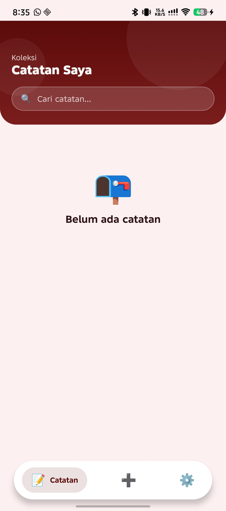
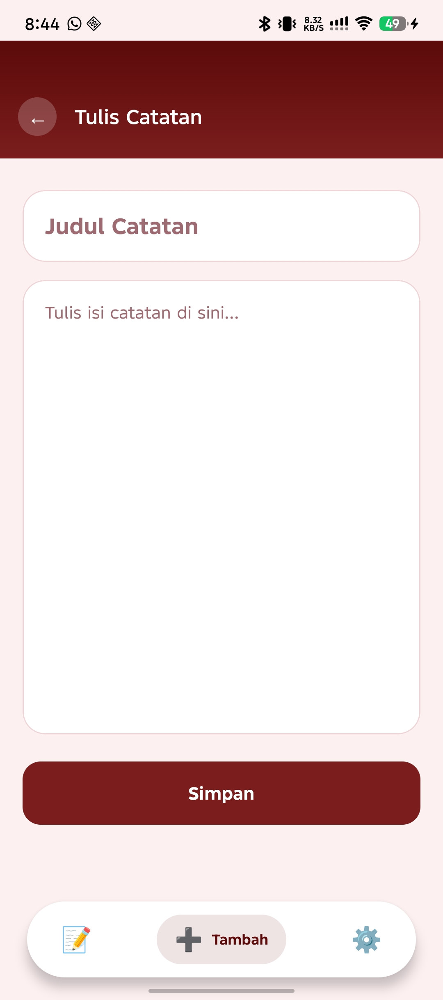
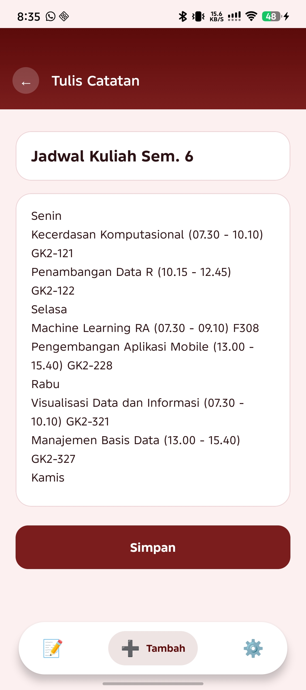
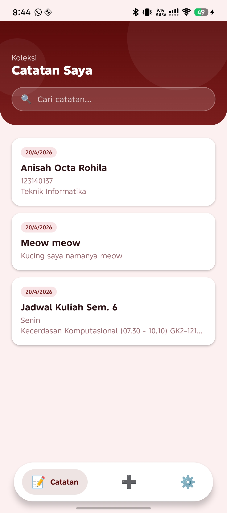
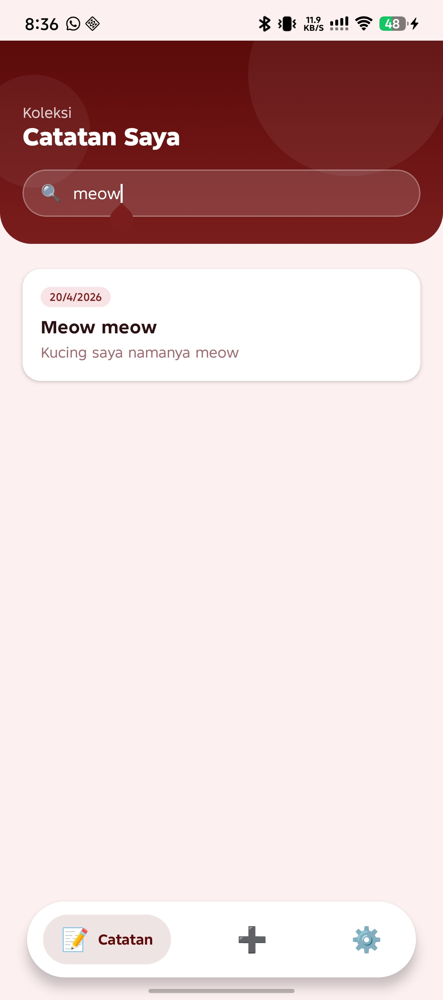
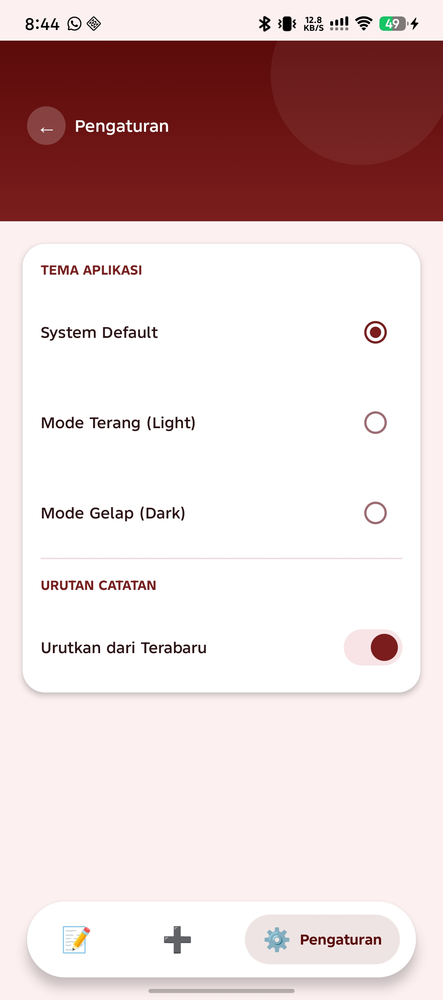
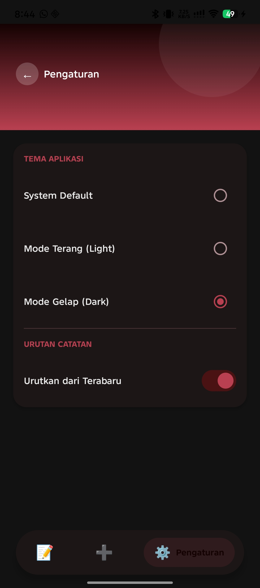
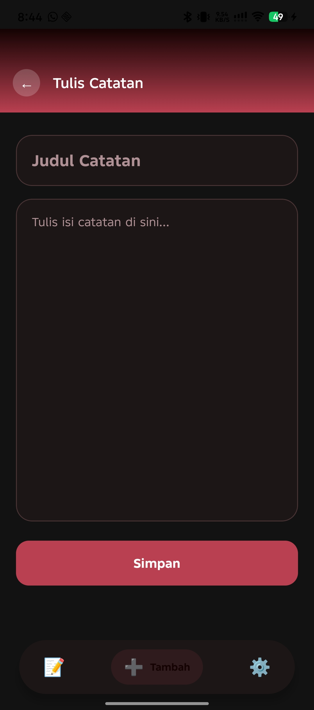
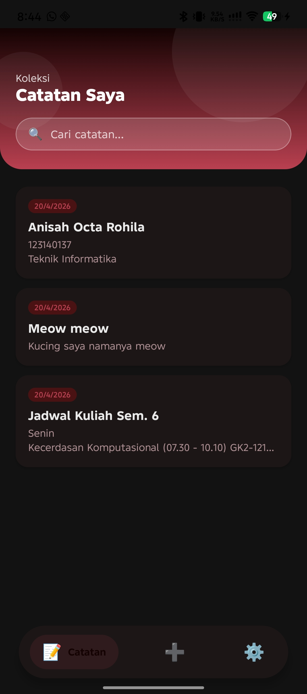

# 📝 Red Velvet Notes App

## 📖 Deskripsi Aplikasi
Aplikasi catatan (Notes App) modern berbasis **Kotlin Multiplatform** yang dirancang dengan antarmuka elegan bertema kemerahan "Red Velvet". Aplikasi ini difokuskan pada manajemen catatan sehari-hari secara *Offline-First* yang stabil, responsif, dan kaya fungsi pada multi-perangkat.

## ✨ Fitur-fitur
- **CRUD Notes**: *Create, Read, Update,* dan *Delete* catatan dengan sinkronisasi reaktif seketika berkat Flow.
- **Search Notes**: Fitur penelusuran kata kunci secara *real-time* ke dalam database lokal.
- **Settings (Theme & Sorting)**: Fleksibilitas mengubah preferensi susunan catatan serta fitur adaptasi **Mode Terang (Light) / Gelap (Dark)** secara dinamis.
- **Offline-first storage**: Seluruh catatan tersimpan secara permanen secara lokal di dalam penyimpanan perangkat, aplikasi berjalan sempurna 100% tanpa membutuhkan jaringan internet.

## 🛠️ Teknologi yang Digunakan
- **[Kotlin Multiplatform (KMP)](https://kotlinlang.org/docs/multiplatform.html)**: Bahasa pemrograman mandiri multi-platform.
- **[Compose Multiplatform](https://www.jetbrains.com/lp/compose-multiplatform/)**: Framework pembuat antarmuka UI (*User Interface*) reaktif yang terpadu.
- **[SQLDelight](https://cashapp.github.io/sqldelight/)**: Solusi *Database & CRUD* luring yang handal, diubah secara konversi aman melalui bahasa SQL murni ke fungsi Kotlin.
- **[Multiplatform Settings](https://github.com/russhwolf/multiplatform-settings)** / DataStore: Media penyimpanan primitif ringan untuk mererekam riwayat pengaturan *Theme* dan *Sorting* yang tak hilang sesudah restart aplikasi.

## 🗄️ Database Schema
Aplikasi memakai tabel sentral `NoteEntity` yang sangat terstruktur:
| Kolom | Tipe Data | Keterangan |
| --- | --- | --- |
| `id` | `INTEGER` | Kunci utama (*Primary Key*) unik yang bersifat *Auto-Increment*. |
| `title` | `TEXT` | Menyimpan judul catatan (Wajib Diisi / *Not Null*). |
| `content` | `TEXT` | Memegang muatan isi catatan utuh (*Not Null*). |
| `created_at` | `INTEGER` | Mencatat rentang waktu Unix *Epoch timestamp* kapan *notes* diciptakan pertama kali. |
| `updated_at` | `INTEGER` | Mencatat riwayat waktu (*Epoch timestamp*) detik catatan disentuh/direvisi terakhir. |

## 🚀 Cara Menjalankan Project
Untuk menguji coba jalannya kode atau mem-*build* ke atas emulator/smartphone Android Anda:
1. *Clone* repositori ini / Ekstrak source folder aplikasinya ke penyimpanan fisik Anda.
2. Buka project menggunakan **Android Studio** versi terbaru (disarankan Ladybug ke atas).
3. Tunggu dan pastikan IDE selesai melakukan integrasi *sync project with Gradle files*.
4. Pada *run configurations* di atas *toolbar*, pilih menu instalasi `composeApp` ke target (seperti Android Emulator atau *physical device* USB Anda).
5. Klik **Run** alias Tombol Play hijau (▶️) atau menggunakan shortcut `Shift + F10`.

--- 
## 📸 Dokumentasi Screenshot (Screen-caps)

### ⚪ Inisialisasi & Pengisian Catatan
| State Awal (Kosong) | Form Tambah (Kosong) | Halaman Tambah (Terisi) |
|:---:|:---:|:---:|
|  |  |  |

### 🔍 Penelusuran & Panel Konfigurasi (Terang)
| Daftar Catatan Berisi | Hasil Pencarian Search | Halaman Settings |
|:---:|:---:|:---:|
|  |  |  |

### 🌑 Demonstrasi Mode Gelap (Dark Mode) Dinamis Terpadu
Visual estetik UI menanamkan *Material Theme Color Scheme* dinamis sehingga layar apapun patuh untuk mengganti skinnya tatkala preferensi dirubah dari sistem/Settings.

| *Beranda (Dark Mode)* | *Tulis Form (Dark Mode)* | *Setting Opsi (Dark Mode)* |
|:---:|:---:|:---:|
|  |  |  |
## 🎥 Video Demonstrasi

