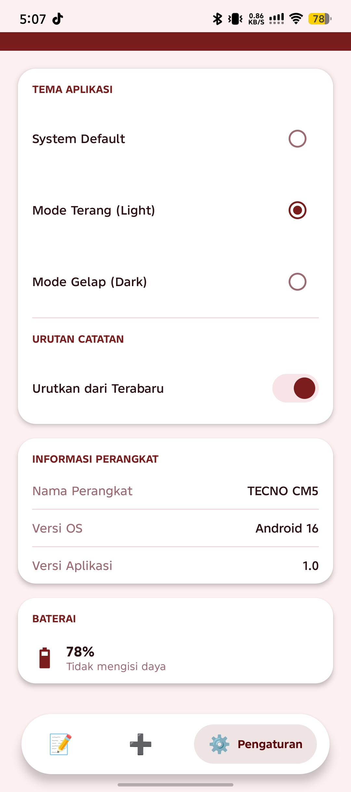
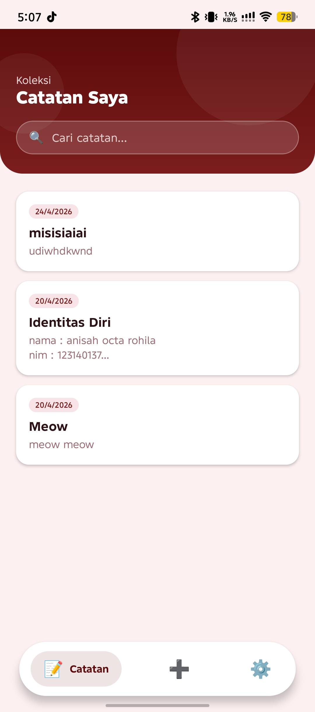
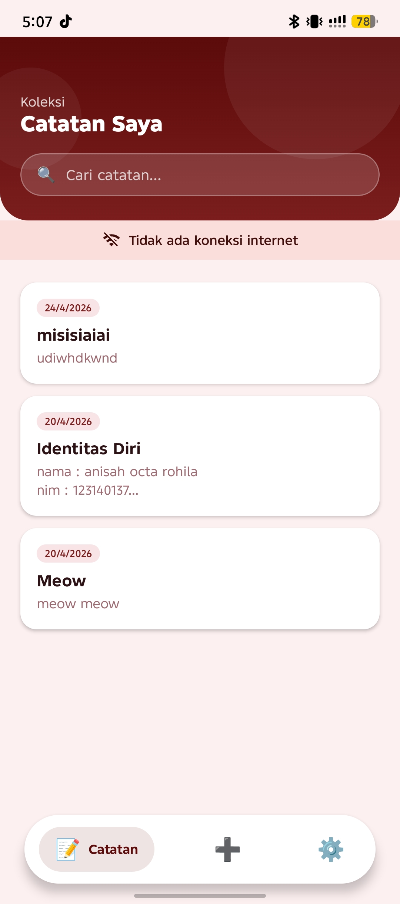
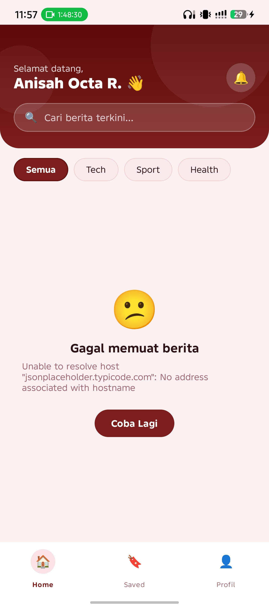

# News Reader App - Week 6 Assignment

A modern, cross-platform News Reader application built with Kotlin Multiplatform and Compose Multiplatform. This project implements a clean design system and adheres to the Week 6 assignment requirements, including API consumption, StateFlow management, and the Repository pattern.

## Features
* **Read Latest News:** Fetch and display a list of current articles with titles, descriptions, and dynamic metadata (time ago, read time, views).
* **Pull-To-Refresh:** Users can swipe down on the home screen to refresh the article list.
* **Persistent Bottom Navigation:** Seamlessly switch between Home, Saved, and Profile screens without losing state.
* **Read Full Article:** Interactive detail pages allowing users to read full contents, save/bookmark, and share.
* **Save / Bookmark News:** Save your favorite articles locally so you can read them later in your collection.
* **UI States Handling:** Comprehensive coverage of `Loading`, `Success`, and `Error` states to ensure smooth UX.
* **Beautiful UI:** Customized gradient header, category chips, and styled data representations.

## Architecture
The application is structured using Modern Android Architecture principles:
* **Ktor Client:** Handles all the network operations asynchronously, properly equipped with Logging and Kotlinx Serialization.
* **Repository Pattern:** `NewsRepository` abstracts the data layer, caching or transforming `ApiPost` into `Article` models, providing a single source of truth to the ViewModel.
* **ViewModel:** `NewsViewModel` contains all the presentation logic and acts as the bridge connecting the UI and the Repository.
* **UI State Management:** Employs a robust `UiState` sealed class (`Loading`, `Success`, `Error`) exposed through `StateFlow` so the UI remains purely reactive and side-effect free.

## API Used
The app consumes data from a public REST API:
* **JSONPlaceholder Posts API:** `https://jsonplaceholder.typicode.com/posts`

## Screenshots

<table>
  <tr>
    <td align="center">
       
      <b>Loading to Home</b>
    </td>
    <td align="center">
       
      <b>Home News List</b>
    </td>
  </tr>
  <tr>
    <td align="center">
       
      <b>News Detail</b>
    </td>
    <td align="center">
       
      <b>Profile Page</b>
    </td>
  </tr>
  <tr>
    <td align="center">
       
      <b>Saved News</b>
    </td>
    <td align="center">
       
      <b>Error State</b>
    </td>
    <td></td>
  </tr>
</table>

## Demo Video
Klik gambar di bawah ini untuk menonton demo aplikasi:

## How to Run

### Requirements
* Android Studio (latest stable version)
* JDK 11 or newer

### Steps to Build
1. Clone or download the project folder (`anisahpam6`).
2. Open Android Studio and select **Open**. Navigate to the project root directory.
3. Allow Gradle to sync completely.
4. Select the `composeApp` run configuration and target an active Android Emulator or physical device.
5. Click **Run** (Shift + F10) to build and install the application.

*To run on iOS (Mac only):* Open Xcode via `iosApp.xcworkspace`, and run the app to a simulator.

## Tech Stack
* Kotlin Multiplatform
* Compose Multiplatform
* Ktor Client
* Kotlinx Serialization
* Kotlin Coroutines & Flow
* Gradle Version Catalogs

## Author
* **Anisah Octa Rohila** - (123140137)