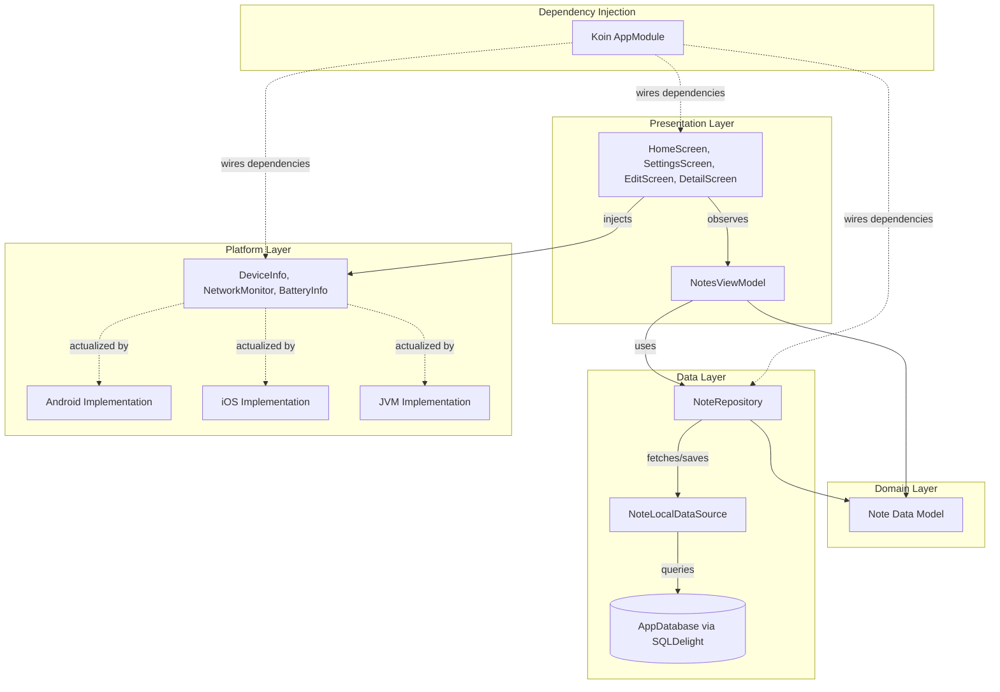

# Notes App (Week 8: Platform-Specific Features)

A Kotlin Multiplatform (KMP) Notes App built with Compose Multiplatform targeting Android, iOS, and JVM Desktop. This week's upgrade introduces **Koin Dependency Injection**, **expect/actual platform APIs** (DeviceInfo, NetworkMonitor, BatteryInfo), and handling of runtime connectivity states to provide a robust offline-first architecture.

---

## 👨‍🎓 Student Info

| Keterangan | Detail |
| :--- | :--- |
| **Nama** | Anisah Octa Rohila |
| **NIM** | 123140137 |
| **Mata Kuliah** | Pengembangan Aplikasi Mobile |
| **Pertemuan** | 8 — Platform-Specific Features |
| **Institusi** | Institut Teknologi Sumatera |

---

## 🎥 Video Demonstrasi

[](https://youtube.com/shorts/B_elMXnySA4?si=L2AxMDFYriGEqwz4)

---

## ✨ Features

- **CRUD Notes**: Create, Read, Update, Delete notes seamlessly.
- **SQLDelight Local Database**: Robust offline-first persistence.
- **Light/Dark Theme Toggle**: Customizable UI themes.
- **Sort Notes**: Order notes dynamically by date or title.
- **Koin Dependency Injection (Week 8)**: Clean architecture wiring using Koin 3.5.3.
- **DeviceInfo via expect/actual**: Displays device name, OS version, and app version based on the platform.
- **NetworkMonitor via expect/actual**: Observes internet connectivity and displays an automatic offline banner.
- **BatteryInfo via expect/actual (Bonus)**: Monitors and displays real-time battery level and charging status.

---

## 🏛️ Architecture Diagram



---

## 🛠️ Tech Stack

| Technology | Description |
| :--- | :--- |
| **Kotlin Multiplatform** | Core logic sharing across platforms |
| **Compose Multiplatform** | Shared UI framework |
| **SQLDelight** | Type-safe multiplatform database |
| **Koin 3.5.3** | Dependency Injection framework |
| **Multiplatform Settings** | Key-value storage for preferences |
| **Coroutines & Flow** | Asynchronous programming and reactive state |
| **Material 3** | Modern UI components and styling |
| **Accompanist Permissions** | Managing runtime permissions |

---

## 🚀 Week 8 Changes

This update significantly refactors the project architecture to implement Platform-Specific functionality:

1. **Koin DI Setup**: Introduced `AppModule.kt`, `MyApplication.kt`, and `viewModelOf` to systematically inject ViewModels, Repositories, and Services.
2. **Platform Expect/Actual API**: Designed a clean architecture pattern for platform-specific hardware APIs (`DeviceInfo`, `NetworkMonitor`, `BatteryInfo`).
3. **Android NetworkMonitor Implementation**: Integrated `ConnectivityManager` combined with `callbackFlow` to reactively observe network state changes.
4. **Android BatteryInfo Implementation (Bonus)**: Interfaced with Android's `BatteryManager` to track current battery capacity and charging status dynamically.
5. **UI Integration**: 
   - Added `DeviceInfoCard` and `BatteryCard` in `SettingsScreen` to display hardware information.
   - Designed a reactive offline banner in `HomeScreen` to notify users when network connectivity drops.

---

## 📂 Project Structure (Week 8 Highlights)

```text
composeApp/src/
├── commonMain/kotlin/com/newsreader/
│   ├── di/AppModule.kt
│   ├── platform/
│   │   ├── DeviceInfo.kt
│   │   ├── NetworkMonitor.kt
│   │   └── BatteryInfo.kt
│   ├── presentation/
│   │   ├── notes/HomeScreen.kt
│   │   └── settings/SettingsScreen.kt
│   └── ...existing structure...
├── androidMain/kotlin/com/newsreader/
│   ├── MyApplication.kt
│   └── platform/
│       ├── DeviceInfo.android.kt
│       ├── NetworkMonitor.android.kt
│       └── BatteryInfo.android.kt
├── iosMain/kotlin/com/newsreader/platform/
│   ├── DeviceInfo.ios.kt
│   ├── NetworkMonitor.ios.kt
│   └── BatteryInfo.ios.kt
└── jvmMain/kotlin/com/newsreader/platform/
    ├── DeviceInfo.jvm.kt
    ├── NetworkMonitor.jvm.kt
    └── BatteryInfo.jvm.kt
```

---

## Screenshots

<table width="100%">
  <tr>
    <th width="33%" align="center">Settings Screen — Device Info & Battery</th>
    <th width="33%" align="center">Home Screen — Offline Mode</th>
    <th width="33%" align="center">Home Screen — Online Mode</th>
  </tr>
  <tr>
    <td align="center"></td>
    <td align="center"></td>
    <td align="center"></td>
  </tr>
  <tr>
    <td align="center"><em>Menampilkan informasi perangkat (nama device, versi OS, versi app) dan status baterai yang di-inject melalui Koin.</em></td>
    <td align="center"><em>Banner "Tidak ada koneksi internet" muncul otomatis di bagian atas saat airplane mode aktif.</em></td>
    <td align="center"><em>Banner hilang secara otomatis ketika koneksi internet kembali tersedia.</em></td>
  </tr>
</table>

---

## 💻 How to Run

### Android (Android Studio / IntelliJ)
1. Clone this repository.
2. Open the project in Android Studio or IntelliJ IDEA.
3. Sync the Gradle files.
4. Select the `composeApp` run configuration and target an Android Emulator or physical device.
5. Click **Run** (Shift + F10).

### iOS
*Note: Requires a Mac environment with Xcode installed.*
1. Open the project in Xcode using the `iosApp/iosApp.xcworkspace`.
2. Select your target simulator or device.
3. Click **Run** (Cmd + R).

### JVM Desktop
To run the JVM desktop application, execute the following command in your terminal:
```bash
./gradlew :composeApp:run
```

---

## 📦 Dependencies Setup

**gradle/libs.versions.toml**
```toml
[versions]
koin = "3.5.3"
koin-compose = "1.1.2"

[libraries]
koin-core = { module = "io.insert-koin:koin-core", version.ref = "koin" }
koin-compose = { module = "io.insert-koin:koin-compose", version.ref = "koin-compose" }
koin-android = { module = "io.insert-koin:koin-android", version.ref = "koin" }
koin-androidx-compose = { module = "io.insert-koin:koin-androidx-compose", version.ref = "koin" }
```

**composeApp/build.gradle.kts**
```kotlin
// commonMain
implementation(libs.koin.core)
implementation(libs.koin.compose)

// androidMain
implementation(libs.koin.android)
implementation(libs.koin.androidx.compose)
```

---

## 🔌 Koin Module Snapshot

**AppModule.kt**
```kotlin
package com.newsreader.di

import org.koin.dsl.module
import org.koin.core.module.dsl.viewModelOf

expect fun platformModule(): Module

val appModules = module {
    // ── Data Layer
    single { AppDatabase(get<DatabaseDriverFactory>().createDriver()) }
    single { NoteLocalDataSource(get()) }
    single { NoteRepository(get()) }
    single { SettingsManager(get<SettingsFactory>().createSettings()) }

    // ── Platform Services
    single { DeviceInfo() }
    single { NetworkMonitor() }
    single { BatteryInfo() }

    // ── ViewModels
    factory { NotesViewModel(get(), get()) }
}
```

---

## 📜 License

MIT License © 2025